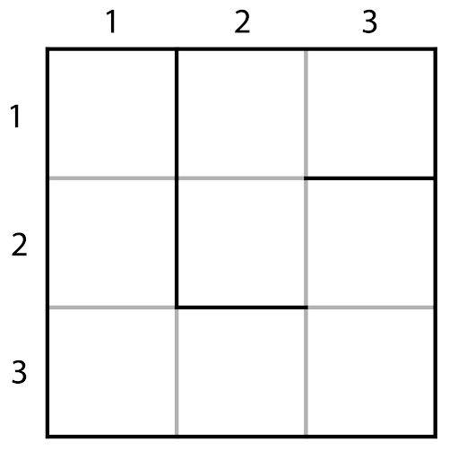

The maze can be represented as a grid of cells. Each maze cell has unique 2D coordinates
(x, y), which define its position within the grid, and from two to four neighbors: two in 
the case of the corner cells like (1, 1) or (1, 3) 
in the example below and four in the case of the inner cells, e.g., (2, 2). A cell may have walls on the north, east, south, 
or west side.

<a href="https://docs.python.org/3/tutorial/classes.html">Classes</a> are a convenient way to define and store custom objects in Python. 
Creating a new class creates a new type of object, and new instances of that type can then be 
made. Each class instance can have attributes and methods attached to it for maintaining and 
modifying its state. We will be using classes to define the objects and functionality needed 
in this course. If you are completely unfamiliar with classes, we suggest that you check out 
the <a href="https://plugins.jetbrains.com/plugin/16630-introduction-to-python">Introduction to Python</a> course or the Python track at <a href="https://hi.hyperskill.org?utm_source=ide&utm_medium=ide&utm_campaign=ide&utm_content=first-task">JetBrains Academy</a> first.

At this stage, we will simply initialize a grid cell with its coordinates. We defined the 
class `Cell` for the maze cell objects. Each cell will be an instance of `Cell`, but they 
will all have unique coordinates. Therefore, it seems appropriate to store coordinates as 
[instance variables](https://docs.python.org/3/tutorial/classes.html#class-and-instance-variables).

### Task 

Let's [initialize](https://docs.python.org/3/tutorial/classes.html#class-objects) a `Cell` at `(x, y)`.

### Run 

Run `output.py` to see the printed output of cell initialization at `(0, 0)`.
To do so, just right-click on the file so that you can see the context menu and select Run ‘output’.

Alternatively, you can use the gutter icon near the `if __name__ == '__main__':`  statement inside `output.py`.
