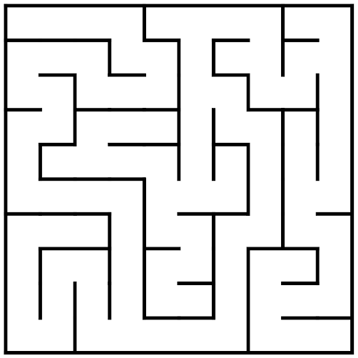

#### Course Prerequisites

Basic Python knowledge:
- Basic Operations
- Loops
- Data Structures
- Functions
- Classes

In this project, we'll generate a 2D maze using an algorithm that treats a completed 
maze as a [tree](https://en.wikipedia.org/wiki/Tree_(data_structure)), where the branches represent paths through the maze. This algorithm 
is called [Depth First Search](https://en.wikipedia.org/wiki/Depth-first_search) (DFS). DFS starts at the root node and explores as far 
as possible along each branch before backtracking. The search remembers previously 
visited nodes and will not repeat them. This is important because performing the 
same search without remembering previously visited nodes results in an infinite loop.

In two dimensions, a maze is a series of paths separated by walls, and for the sake 
of simplicity, one can think of it as a 2-dimensional grid of cells. Each cell is a 
point in the grid that has up to 4 neighbors: to the north, east, south, or west. A 
cell may be separated from its neighbors by walls. If a cell, for example, has a 
neighbor to the east and there is a wall between them, then this neighbor certainly 
has a wall to the west (it is the same wall).

We will start with an $N * N$ grid where all the cells have all four walls ("N", "S", "E", "W"). 
To go from a grid of unconnected cells to a maze, we will need to knock down some of 
them. When a new cell is visited by the algorithm, the wall between the new cell and 
the previous one is removed. 

The algorithm that we will write should produce a path visiting each cell of the grid 
according to the following rules:
- Start in a given cell and mark it as visited.
- If any of the neighboring cells have not yet been visited, pick one of them at random, 
  move into it, and remove the wall between the two cells.
- If all the neighbors have already been visited, move back to the last cell with a 
  not-visited neighbor. 

Once there are no more unvisited cells left – the maze is built, and the algorithm terminates.

<i>This course was devised as part of the Museum of Future exhibit “Maze solver via Reinforcement 
Learning”. The exhibit demonstrates how Reinforcement Learning can be used to solve a maze, that 
is, to reach the exit as quickly as possible. To be able to complete this course you don’t need 
to visit the Museum, even though it would certainly be fun! </i>